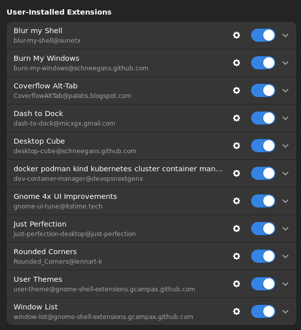

# linux-home

### `sudoers` ADD
```
kira ALL=(ALL) NOPASSWD: ALL


sudo apt install gnome-session -y

sudo vi 60x11-common_xdg_path 
DEFAULT_XDG_DATA_DIRS=DEFAULT_XDG_DATA_DIRS='/usr/local/share/:/usr/share/:/opt/applications/share/:/home/kira/.local/share/flatpak/exports/share/:/var/lib/flatpak/exports/share/:/home/kira/.local/share/applications/'
```

### Install Software
```
sudo apt install -y yq flatpak 
sudo add-apt-repository ppa:flatpak/stable
sudo apt update
sudo apt install flatpak
sudo apt install gnome-software-plugin-flatpak
flatpak remote-add --if-not-exists flathub https://dl.flathub.org/repo/flathub.flatpakrepo
flatpak install flathub com.mattjakeman.ExtensionManager
flatpak run com.mattjakeman.ExtensionManager
```

### Install Docker
```
sudo apt-get install ca-certificates curl gnupg
sudo install -m 0755 -d /etc/apt/keyrings
curl -fsSL https://download.docker.com/linux/ubuntu/gpg | sudo gpg --dearmor -o /etc/apt/keyrings/docker.gpg
sudo chmod a+r /etc/apt/keyrings/docker.gpg
echo \
  "deb [arch=$(dpkg --print-architecture) signed-by=/etc/apt/keyrings/docker.gpg] https://download.docker.com/linux/ubuntu \
  $(. /etc/os-release && echo "$VERSION_CODENAME") stable" | \
  sudo tee /etc/apt/sources.list.d/docker.list > /dev/null
sudo apt update
sudo apt install -y docker-ce docker-ce-cli containerd.io docker-buildx-plugin docker-compose-plugin
sudo usermod -aG docker $USER

curl -Lo ./kind https://kind.sigs.k8s.io/dl/v0.20.0/kind-linux-amd64 && chmod 755 kind && sudo mv kind /usr/bin/kind
```

### download images in bulk job
```bash
# Run below command:
download https://szcdn1.ragalahari.com/may2013/posters/rajakota-rahasyam-heroine-poojachopra/rajakota-rahasyam-heroine-poojachopra 136 pooja-chopra
```
### vscode settings terminal font
```json
{
    "terminal.integrated.fontFamily": "MesloLGS NF, Regular"
}
```

### macos theme
- Gnome Extension Manager: Install `User Themes`
- https://www.gnome-look.org/p/2100079 and https://www.gnome-look.org/p/2023325 download file

```bash
sudo apt install gnome-shell-extension-manager gnome-tweaks -y

./install.sh -m -t all -l -c Dark -N stable --normal
```

### Gnome Extensions

